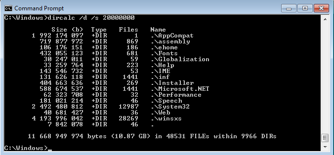

# DIRCALC

DIRCALC is a small (9kb) but powerful and fast program that displays the disk usage in bytes for any given directory.

## Usage: DIRCALC [/D] [/S size] [/L levels] [/A] [directory_location]

/D       Displays only the sizes of the DIRs, ommiting the FILEs

/S size  Displays only FILEs and DIRs whose byte-size is = or > than given

/L level Displays the FILE and DIR sizes for the given level

/A       Displays all files at all levels

HELP     Displays the help, i.e. this page

## Examples:

dircalc 

dircalc C:\Users\Public\Desktop 

dircalc /L 10 %temp% 

dircalc /D \\REMOTE\Folder\ 

dircalc /S 1000000 

dircalc /A 

### DIRCALC 1.0 (c) Copyright Shpati Koleka MMXXI - MIT License
